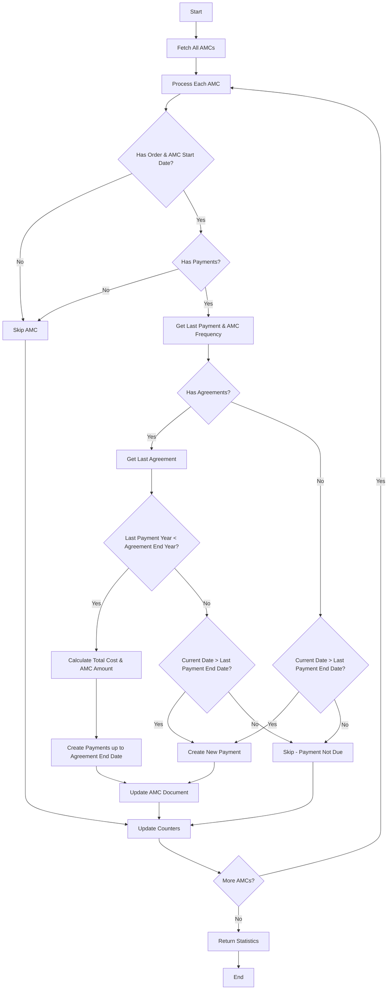

# AMC Payment Update Logic

## Function: `updateAMCPayments()`

### Purpose
This function is responsible for automatically updating Annual Maintenance Contract (AMC) payments based on agreement end dates and payment schedules. It ensures all AMC payments are properly created up to the agreement period defined in the Order.

### Scheduling & Execution

This function is scheduled to run automatically via a cron job:

```typescript
// In src/modules/cron/cron.service.ts
@Cron(CronExpression.EVERY_DAY_AT_1AM)
async updateAMCPayments() {
  try {
    this.loggerService.log('Starting daily AMC payment update cron job');
    await this.orderService.updateAMCPayments();
    this.loggerService.log(
      'Successfully completed AMC payment update cron job',
    );
  } catch (error: any) {
    this.loggerService.error(
      JSON.stringify({
        message: 'Error in AMC payment update cron job',
        data: { error: error.message },
      }),
    );
  }
}
```

The function runs daily at 1:00 AM to ensure AMC payments are kept up-to-date without requiring manual intervention.

### Logic Flow Diagram



### Logic Flow

1. **Initialization**:
   - Fetch all AMCs from the database with their related Order details
   - Initialize counters for tracking processing statistics (updated, skipped, errors, etc.)

2. **For Each AMC**:
   - **Validation**:
     - Skip AMCs without an order or AMC start date
     - Skip AMCs with empty payments array
   
   - **Get Last Payment**:
     - Retrieve the latest payment from the AMC payments array
     - Retrieve AMC frequency from client settings (defaults to 12 months)

   - **Agreement-Based Logic**:
     - Check if the Order has any agreements
     - If an agreement exists, get the most recent one (last element in the array)
     - Compare the last agreement end year with the last payment's to_date year
     - If the last payment year is less than the agreement end year:
       - Calculate total cost (base cost + customization costs + license costs)
       - Calculate AMC amount based on the total cost and AMC rate percentage
       - Create new payments to cover the entire period up to the agreement end date
       - Add each payment to the AMC document in the database
       - Update counters for added payments
     - If the last payment year already covers the agreement end year:
       - Check if current date is after the last payment end date
       - If yes, create a new payment for the next period
       - If no, skip this AMC as payment is not due yet

   - **Non-Agreement Logic**:
     - If no agreement exists, use date-based logic
     - If current date is after the last payment end date, create a new payment
     - Otherwise, skip as payment is not due yet

3. **Error Handling**:
   - Individual AMC processing errors are caught and logged
   - Processing continues for remaining AMCs
   - Top-level errors are caught, logged and rethrown

4. **Reporting**:
   - Return statistics about the AMC payment update process:
     - Number of AMCs processed 
     - Number of AMCs updated
     - Number of AMCs skipped
     - Number of errors encountered
     - Number of new payments added

### Payment Creation Logic

When creating a new payment, the function:
1. Calculates the payment period (from the last payment's end date)
2. Determines the appropriate cost by including:
   - Base order cost
   - Cost of all customizations
   - Cost of all licenses (rate × quantity)
3. Calculates the AMC amount based on the configured percentage
4. Creates a payment record with PENDING status
5. Updates the AMC document with the new payment

### Key Interactions
- **Client Settings**: Uses the client's configured AMC frequency (in months)
- **Order Agreements**: Uses agreement end dates to determine payment coverage
- **AMC Rate**: Uses the configured percentage from the order to calculate AMC amount

### Example Scenarios

**Scenario 1: Agreement Coverage**
- Order Agreement: 2024-01-01 to 2026-01-01 
- Latest AMC Payment: Covers until 2025-01-01
- Action: Create a new payment from 2025-01-01 to 2026-01-01

**Scenario 2: No Agreement/Date-based**
- Latest AMC Payment: Covers until 2025-01-01
- Current Date: 2025-02-01 (after payment period)
- Action: Create a new payment from 2025-01-01 to 2026-01-01

**Scenario 3: Already Covered**
- Order Agreement: 2024-01-01 to 2026-01-01
- Latest AMC Payment: Covers until 2026-01-01
- Action: Skip payment creation (already covered)

**Scenario 4: Not Yet Due**
- Latest AMC Payment: Covers until 2025-01-01
- Current Date: 2024-10-01 (still within payment period)
- Action: Skip payment creation (not due yet)

### Logging
The function includes comprehensive logging at each step:
- Process start and completion
- AMC processing details
- Payment creation confirmations
- Skip reasons
- Error details

### Related Functions

- `createNewPayment()`: Helper method for creating and storing new payment entries
- `getNextDate()`: Calculates the next payment date based on a date and frequency

### Manual Triggering

While the function runs automatically via the cron job, it can also be manually triggered through the API if needed:

```
POST /api/admin/amc/update-payments
```

This endpoint requires administrative privileges and can be used to force an immediate update of all AMC payments.

## Function: `getAmcReviewByOrderId()`

### Purpose
This function generates a projected payment schedule for a specific order's AMC. It provides a comprehensive view of all payments (past, current, and future) based on the order details, agreement timelines, and active/inactive periods.

### Key Enhancements

#### 1. Agreement-Based Calculation
The function now calculates payments all the way to the last agreement's end date rather than just the current year:

```typescript
// Check for last agreement in the order to determine end year
const agreements = order.agreements || [];
const lastAgreement = agreements.length > 0 ? agreements[agreements.length - 1] : null;
      
// Determine end year based on either agreement or current year
let endYear = currentYear + 1;
if (lastAgreement) {
  const agreementEndYear = new Date(lastAgreement.end).getFullYear();
  endYear = Math.max(agreementEndYear, endYear);
  // ... logging ...
}
```

This ensures that all payments up to the contractual agreement end date are included in the review, providing better long-term planning capabilities.

#### 2. Inactive Period Handling
The function identifies periods when the order was inactive by analyzing the status_logs.

```typescript
// Process status logs to identify inactive periods
const inactivePeriods = [];
// ... logic to extract inactive start/end dates ...
```

When generating the initial payment schedule, each payment period is checked for significant overlap with these inactive periods:

```typescript
// Check if this payment period overlaps significantly with any inactive period
let is_inactive = false;
for (const period of inactivePeriods) {
  // Check for significant overlap (fully contained or >50% within inactive period)
  const isMostlyWithinInactivePeriod = (
    // ... overlap detection logic ...
  );
  
  if (isMostlyWithinInactivePeriod) {
    is_inactive = true;
    // ... logging ...
    break;
  }
}

// Add payment with is_inactive flag
payments.push({
  // ... other payment details ...
  is_inactive: is_inactive 
});
```

After generating the full schedule, the function filters the results:

```typescript
// Filter out payments that are fully within inactive periods 
// but keep the payments that are at the edges
const activePayments = payments.filter(payment => {
  // Keep non-inactive payments
  if (!payment.is_inactive) return true;
  
  // For inactive payments, check if they are at the edges
  for (const period of inactivePeriods) {
    // Keep payment right before inactive period starts (prepaid)
    const isRightBeforeInactivePeriod = isSameDay(payment.to_date, period.start);
    // Keep payment right after inactive period ends (reactivation)
    const isRightAfterInactivePeriod = isSameDay(payment.from_date, period.end);
    
    if (isRightBeforeInactivePeriod || isRightAfterInactivePeriod) {
      return true; // Keep edge payments
    }
  }
  
  // Filter out other inactive payments
  return false;
});

return activePayments;
```

This means:
- Payments fully within an inactive period (or with >50% overlap) are marked `is_inactive`.
- Payments marked `is_inactive` are **excluded** from the final result, **unless**:
  - The payment's `to_date` exactly matches the `start` of an inactive period (representing the prepaid AMC for the upcoming inactive year).
  - The payment's `from_date` exactly matches the `end` of an inactive period (representing the AMC for the period when the order becomes active again).

This ensures the AMC review accurately reflects payable periods, including the transition points around inactivity.

### Logic Flow

1. **Initialization**:
   - Fetch the order with populated relationships (customizations, licenses, client details)
   - Verify the AMC exists for the order
   - Get the AMC frequency from client settings

2. **Agreement & End Date Determination**:
   - Check if the order has any agreements
   - If an agreement exists, use the end date of the last agreement to determine how far into the future to calculate payments
   - If no agreement exists, calculate payments until current year + 1

3. **Inactive Period Identification**:
   - Process the order's status_logs to identify periods when the order was inactive
   - Track the start and end dates of each inactive period

4. **Payment Schedule Generation**:
   - Create payment entries from the AMC start date to the determined end date
   - Check each payment period against the inactive periods
   - Mark any payment that overlaps with an inactive period with `is_inactive: true`

5. **AMC Rate Application**:
   - Apply historical AMC rates to payments based on the order's rate history
   - Calculate payment amounts based on the appropriate rates for each period

6. **Additional Purchase Integration**:
   - Adjust payment costs based on customizations purchased during the AMC period
   - Adjust payment costs based on licenses purchased during the AMC period

7. **Reporting**:
   - Return the complete payment schedule with inactive flags
   - Log details about the calculation process including total payments and inactive periods

### Example Scenarios

**Scenario 1: Agreement-Based End Date**
- Order has agreement until 2028-01-01
- Current year is 2024
- Result: Payments are calculated until 2028 instead of just 2025

**Scenario 2: Inactive Periods**
- Order has an inactive period from 2025-03-01 to 2026-03-01
- AMC Start Date: 2024-03-01
- Result: 
    - Payment 2024-03-01 to 2025-03-01 (paid in 2024) is **included** (prepaid before inactivity).
    - Payment 2025-03-01 to 2026-03-01 (covers inactive period) is **excluded**.
    - Payment 2026-03-01 to 2027-03-01 (paid in 2026) is **included** (reactivation period).

**Scenario 3: Open Inactive Period**
- Order was set to inactive on 2024-05-01 with no reactivation. Last agreement ends 2027-01-01.
- AMC Start Date: 2023-01-01
- Result: 
    - Payments for 2023-2024 are **included**.
    - Payment 2024-01-01 to 2025-01-01 (paid in 2024, covers the start of inactivity) is **included**.
    - Payments from 2025-01-01 onwards (fully within the open inactive period) are **excluded**.

### Implementation Details

- The function returns an array of payment objects, each containing:
  - Payment dates (from_date, to_date)
  - Payment status
  - AMC rate information
  - Total cost
  - `is_inactive` flag indicating if the payment period overlaps with an inactive period

- The client application should treat the returned array as the list of billable/reviewable AMC periods, as non-billable inactive periods (except the specific edge cases) have already been filtered out by the service.

### Key Enhancements

#### 2. Inactive Period Handling
The function identifies periods when the order was inactive by analyzing the status_logs.

```typescript
// Process status logs to identify inactive periods
const inactivePeriods = [];
// ... logic to extract inactive start/end dates ...
```

When generating the initial payment schedule, each payment period is checked for significant overlap with these inactive periods:

```typescript
// Check if this payment period overlaps significantly with any inactive period
let is_inactive = false;
for (const period of inactivePeriods) {
  // Check for significant overlap (fully contained or >50% within inactive period)
  const isMostlyWithinInactivePeriod = (
    // ... overlap detection logic ...
  );
  
  if (isMostlyWithinInactivePeriod) {
    is_inactive = true;
    // ... logging ...
    break;
  }
}

// Add payment with is_inactive flag
payments.push({
  // ... other payment details ...
  is_inactive: is_inactive 
});
```

After generating the full schedule, the function filters the results:

```typescript
// Filter out payments that are fully within inactive periods 
// but keep the payments that are at the edges
const activePayments = payments.filter(payment => {
  // Keep non-inactive payments
  if (!payment.is_inactive) return true;
  
  // For inactive payments, check if they are at the edges
  for (const period of inactivePeriods) {
    // Keep payment right before inactive period starts (prepaid)
    const isRightBeforeInactivePeriod = isSameDay(payment.to_date, period.start);
    // Keep payment right after inactive period ends (reactivation)
    const isRightAfterInactivePeriod = isSameDay(payment.from_date, period.end);
    
    if (isRightBeforeInactivePeriod || isRightAfterInactivePeriod) {
      return true; // Keep edge payments
    }
  }
  
  // Filter out other inactive payments
  return false;
});

return activePayments;
```

This means:
- Payments fully within an inactive period (or with >50% overlap) are marked `is_inactive`.
- Payments marked `is_inactive` are **excluded** from the final result, **unless**:
  - The payment's `to_date` exactly matches the `start` of an inactive period (representing the prepaid AMC for the upcoming inactive year).
  - The payment's `from_date` exactly matches the `end` of an inactive period (representing the AMC for the period when the order becomes active again).

This ensures the AMC review accurately reflects payable periods, including the transition points around inactivity.

### Example Scenarios

**Scenario 1: Agreement-Based End Date**
- Order has agreement until 2028-01-01
- Current year is 2024
- Result: Payments are calculated until 2028 instead of just 2025

**Scenario 2: Inactive Periods**
- Order has an inactive period from 2025-03-01 to 2026-03-01
- AMC Start Date: 2024-03-01
- Result: 
    - Payment 2024-03-01 to 2025-03-01 (paid in 2024) is **included** (prepaid before inactivity).
    - Payment 2025-03-01 to 2026-03-01 (covers inactive period) is **excluded**.
    - Payment 2026-03-01 to 2027-03-01 (paid in 2026) is **included** (reactivation period).

**Scenario 3: Open Inactive Period**
- Order was set to inactive on 2024-05-01 with no reactivation. Last agreement ends 2027-01-01.
- AMC Start Date: 2023-01-01
- Result: 
    - Payments for 2023-2024 are **included**.
    - Payment 2024-01-01 to 2025-01-01 (paid in 2024, covers the start of inactivity) is **included**.
    - Payments from 2025-01-01 onwards (fully within the open inactive period) are **excluded**.

### Implementation Details

- The function returns an array of payment objects, each containing:
  - Payment dates (from_date, to_date)
  - Payment status
  - AMC rate information
  - Total cost
  - `is_inactive` flag indicating if the payment period overlaps with an inactive period

- The client application should treat the returned array as the list of billable/reviewable AMC periods, as non-billable inactive periods (except the specific edge cases) have already been filtered out by the service. 